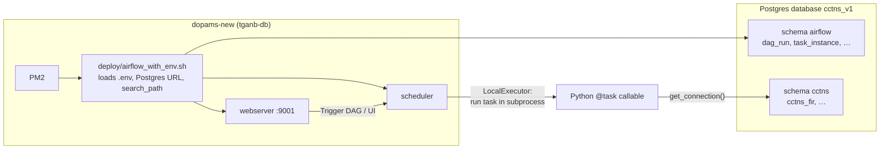
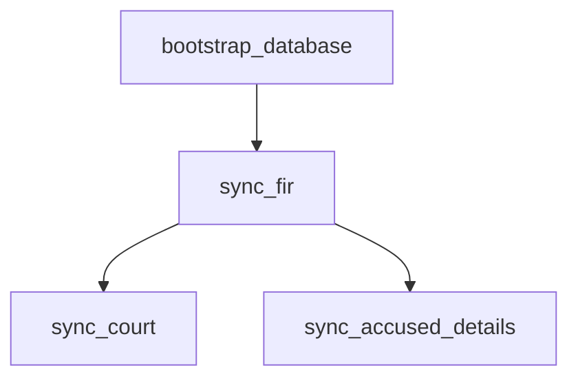
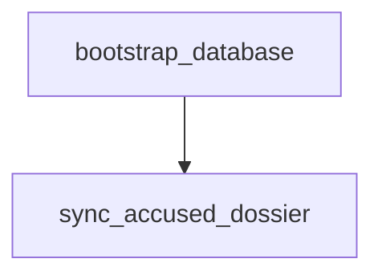

# Airflow DAGs — how they run

This folder defines **two nightly DAGs** that orchestrate the CCTNS V1 ETL. The business logic (HTTP fetch, upsert, schema bootstrap) lives in **`dags/pipeline_run.py`** and **`apis/`** / **`db/`** — the DAG files only wire **tasks** and **dependencies**.

For the full pipeline story (APIs, Postgres, upsert, schemas), see **[`../pipeline.md`](../pipeline.md)**.  
For server deploy and PM2, see **[`../deploy/README.md`](../deploy/README.md)**.

---

## How Airflow executes these DAGs



| Setting | Value |
|--------|--------|
| **Schedule (IST)** | Simple APIs **00:30 IST** (`0 19 * * *` UTC). Accused dossier **01:30 IST** (`0 20 * * *` UTC). |
| **Executor** | `LocalExecutor` (tasks run as local Airflow worker processes) |
| **DAG folder** | `CCTNSV1_DAILY_ETL_RUN/dags/` |
| **Config** | Project root `.env` (loaded by `config/settings.py` and `deploy/airflow_with_env.sh`) |
| **Catchup** | `False` — no backfill of past schedule slots |
| **max_active_runs** | `1` per DAG — no overlapping scheduled+manual runs of the same DAG |
| **Entity run lock** | `db/run_lock.py` flock per entity (`/tmp/cctns_v1_etl_<entity>.lock`) — blocks concurrent accused (or fir) extracts even across DAGs/CLI |

After every `git pull` on the server, run **`./deploy/reload_pm2.sh`** so scheduler and webserver pick up DAG file changes.

---

## Files in this folder

| File | Role |
|------|------|
| **`daily_sync_fir_court_accused_details.py`** | DAG 1: FIR + Court + Accused Details |
| **`daily_sync_accused_dossier.py`** | DAG 2: Accused date-range dossier |
| **`cctnsv1_dag_common.py`** | Shared `start_date`, schedule, retries, tags |
| **`pipeline_run.py`** | Extract/load for each entity; used by every sync task |

DAG IDs (what you see in the UI):

- `cctns_v1_daily_sync_fir_court_accused_details`
- `cctns_v1_daily_sync_accused_dossier`

---

## DAG 1 — `cctns_v1_daily_sync_fir_court_accused_details`

**Purpose:** Three **unfiltered GET** APIs that return the full dataset each run (no date chunking).



### Tasks

| Task ID | What it runs | Postgres write today? |
|---------|----------------|------------------------|
| **`bootstrap_database`** | `ensure_schema()` + `ensure_airflow_metadata()` | DDL only (tables, Airflow metadata migrate) |
| **`sync_fir`** | `run_single_entity("fir")` | **Yes** — upsert into `cctns.cctns_fir` on `fir_reg_num` |
| **`sync_court`** | `run_single_entity("court")` | **No** — fetch + log count only (`upsert_ready: False`) |
| **`sync_accused_details`** | `run_single_entity("accused_details")` | **No** — same |

Court and accused details run **in parallel** after FIR (both depend on `sync_fir` only for ordering in the graph; load does not require FIR to finish first, but the DAG is structured so FIR runs first).

### Task code path (example: `sync_fir`)

1. Airflow starts a subprocess and calls the `@task` function in `daily_sync_fir_court_accused_details.py`.
2. That calls `run_single_entity("fir")` in `pipeline_run.py`.
3. `get_connection()` may call `ensure_schema()` again (idempotent).
4. `fetch_fir()` → HTTP GET → list of dicts.
5. If `upsert_ready`, `upsert_records()` → commit; else warning log and status `not_loaded_pending_key`.
6. `raise_if_task_failed()` — task **fails** on `extract_failed`, `load_failed`, or `extract_partial_failed` (any date window failed).

**Retries:** `default_args`: 2 retries, 5 minutes apart (`cctnsv1_dag_common.py`).

---

## DAG 2 — `cctns_v1_daily_sync_accused_dossier`

**Purpose:** One **POST date-range** API that must be pulled in **7-day chunks** with **adaptive day halving** when Oracle returns `ORA-06502` (buffer too small).



| Task ID | What it runs | Postgres write today? |
|---------|----------------|------------------------|
| **`bootstrap_database`** | Same as DAG 1 | DDL / migrate only |
| **`sync_accused_dossier`** | `run_single_entity("accused")` | **No** — fetch only until `natural_key` is live |

Date window: **`ACCUSED_FULL_PULL_START_DATE`** → today (from `.env`, default `01-01-2002`). This DAG can run **much longer** than DAG 1; it is separate so failures and retries do not block FIR/court/accused-details.

---

## “Task success” vs “data in Postgres”

Airflow marks a task **success** when the Python callable returns without raising. That is **not** the same as “rows were inserted.”

| Result status (`pipeline_run.py`) | Airflow task | Rows in DB |
|-----------------------------------|--------------|------------|
| `loaded` | Success (if no exception) | Insert/update/skip via upsert |
| `not_loaded_pending_key` | **Success** | **None** for that entity |
| `extract_partial_failed` | **Failed** | **None** this run (upsert skipped); failures in `cctns_v1_failed_fetch_window` |
| `extract_failed` | **Failed** (after retries) | None |
| `load_failed` | **Failed** (after retries) | None (transaction rolled back) |

So a **green** `sync_court` or `sync_accused_details` only means the API call succeeded and the run was logged — check task logs for `fetched=` and the warning about `NOT loaded`.

---

## Where to see output

| What | Where |
|------|--------|
| Per-task fetch/upsert counts | Airflow UI → DAG → Task → **Logs** |
| Log files on disk | `airflow_home/logs/dag_id=…/run_id=…/task_id=…/` |
| Structured run history (after `001_schema_fix.sql`) | Postgres `cctns.cctns_v1_etl_run_log` |
| Field-level updates on upsert (after migration) | `cctns.cctns_v1_audit_log` |

---

## Run without Airflow (debug)

From project root, with `.env` present:

```bash
cd cctns-v1/CCTNSV1_DAILY_ETL_RUN
PYTHONPATH=. ./venv/bin/python dags/pipeline_run.py simple    # FIR + court + accused_details
PYTHONPATH=. ./venv/bin/python dags/pipeline_run.py accused   # accused dossier only
```

Or a single entity:

```bash
PYTHONPATH=. ./venv/bin/python -c "from dags.pipeline_run import run_single_entity; print(run_single_entity('fir'))"
```

---

## Trigger from CLI (on server)

```bash
cd ~/dopams/DOPAMS-ETL/cctns-v1/CCTNSV1_DAILY_ETL_RUN
./deploy/airflow_with_env.sh dags trigger cctns_v1_daily_sync_fir_court_accused_details
./deploy/airflow_with_env.sh dags trigger cctns_v1_daily_sync_accused_dossier
```

UI: `http://<dopams-new-ip>:9001` — credentials template in `deploy/airflow-credentials.example.txt`.

---

## Why two DAGs instead of one graph

| DAG 1 | DAG 2 |
|-------|--------|
| 3× fast GET | 1× slow POST, many 7-day windows |
| ~seconds to minutes | Can take a long time; may record `failed_windows` |
| FIR load is operational today | Accused load blocked on `natural_key` review |

Keeping them separate makes monitoring, retries, and on-call response simpler.
