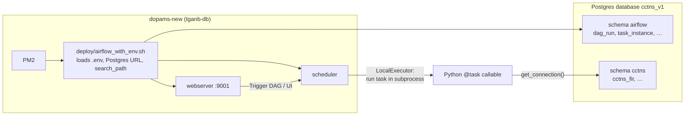

# Airflow DAGs — how they run

This folder defines **one data DAG** (`cctns_v1_daily_cycle`, every 6 hours from 00:00 IST) plus the separate media DAG. The business logic (HTTP fetch, upsert, schema bootstrap) lives in **`dags/pipeline_run.py`** and **`apis/`** / **`db/`**. Cycle order, the shared `run_id`, and the success marker live in **`db/orchestrate_cycle.py`**.

For the full pipeline story (APIs, Postgres, upsert, schemas), see **[`../pipeline.md`](../pipeline.md)**.  
For server deploy and PM2, see **[`../deploy/README.md`](../deploy/README.md)**.

---

## How Airflow executes these DAGs



| Setting | Value |
|--------|--------|
| **Schedule (IST)** | Data cycle every **6 hours** at 00:00, 06:00, 12:00, 18:00 IST (`30 0,6,12,18 * * *` UTC). Media **05:00 IST**, outside the gate. `max_active_runs=1` so a long accused pull blocks the next tick without moving the clock. |
| **Executor** | `LocalExecutor` (tasks run as local Airflow worker processes) |
| **DAG folder** | `CCTNSV1_DAILY_ETL_RUN/dags/` |
| **Config** | Project root `.env` (loaded by `config/settings.py` and `deploy/airflow_with_env.sh`) |
| **Catchup** | `False` — no backfill of past schedule slots |
| **max_active_runs** | `1` per DAG — no overlapping scheduled+manual runs of the same DAG |
| **Cycle lock** | `db/cycle_lock.py` — one flock for the whole data cycle (`cctns_v1_etl_cycle.lock`) |
| **Entity run lock** | `db/run_lock.py` flock per entity — still blocks two extracts of the same entity |

After every `git pull` on the server, run **`./deploy/reload_pm2.sh`** so scheduler and webserver pick up DAG file changes.

---

## Files in this folder

| File | Role |
|------|------|
| **`daily_cycle.py`** | The only data DAG: FIR, then court + accused details, then accused |
| **`daily_sync_fir_court_accused_details.py`** | Retired. Does not register a DAG |
| **`daily_sync_accused_dossier.py`** | Retired. Does not register a DAG |
| **`cctnsv1_dag_common.py`** | Shared `start_date`, schedule, retries, tags |
| **`pipeline_run.py`** | Extract/load for each entity; used by every sync task |

DAG IDs (what you see in the UI):

- `cctns_v1_daily_cycle` — data cycle every 6 hours (00:00, 06:00, 12:00, 18:00 IST)
- `cctns_v1_daily_sync_media_attachments` — media, 05:00 IST, not part of the V1 completion marker

The data cycle is one task, `run_daily_cycle`. It acquires `cctns_v1_etl_cycle.lock`, uses one `run_id`, runs FIR, then court and accused details together, then accused, and inserts `cctns_v1_etl_cycle.status = succeeded` only when all four stored rows pass that order. `loaded` and `loaded_with_known_gaps` are the success statuses. A failed or partial run is `failed` or `incomplete` and is not a marker.

CLI `simple`, `accused`, and `run_single_entity` take the same lock and a run_id, and they always finish `incomplete`.

---

## Run without Airflow (debug)

From project root, with `.env` present:

```bash
cd cctns-v1/CCTNSV1_DAILY_ETL_RUN
PYTHONPATH=. ./venv/bin/python dags/pipeline_run.py cycle     # full cycle; the only success marker
PYTHONPATH=. ./venv/bin/python dags/pipeline_run.py simple    # subset; marker withheld
PYTHONPATH=. ./venv/bin/python dags/pipeline_run.py accused   # subset; marker withheld
```

---

## Trigger from CLI (on server)

```bash
cd ~/dopams/DOPAMS-ETL/cctns-v1/CCTNSV1_DAILY_ETL_RUN
./deploy/airflow_with_env.sh dags trigger cctns_v1_daily_cycle
```

UI: `http://<dopams-new-ip>:9001` — credentials template in `deploy/airflow-credentials.example.txt`.

Do not trigger the retired split DAG ids. Those modules no longer register DAGs.

The attempt timeout is 12 hours so the existing 8-hour accused pull still fits after FIR, court, and accused details. The DAG run ceiling is 37 hours so the two Airflow retries are not cut off.

Entity result statuses are unchanged. loaded and loaded_with_known_gaps commit the upsert. extract_failed, load_failed, extract_partial_failed, and alidate_orphan_fir_failed do not, and they fail the cycle so no success marker is written.

| What | Where |
|------|--------|
| Cycle marker | cctns.cctns_v1_etl_cycle (succeeded only) |
| Per-entity rows for that 
un_id | cctns.cctns_v1_etl_run_log |
| Airflow task log | irflow_home/logs/dag_id=cctns_v1_daily_cycle/ |
