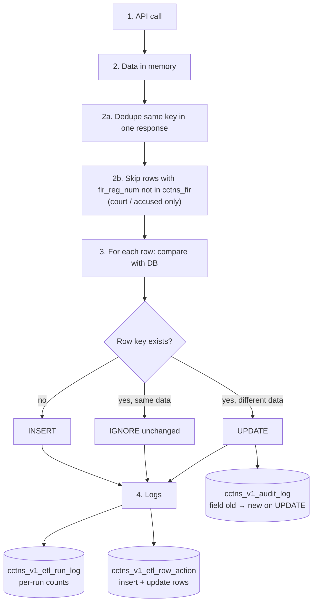
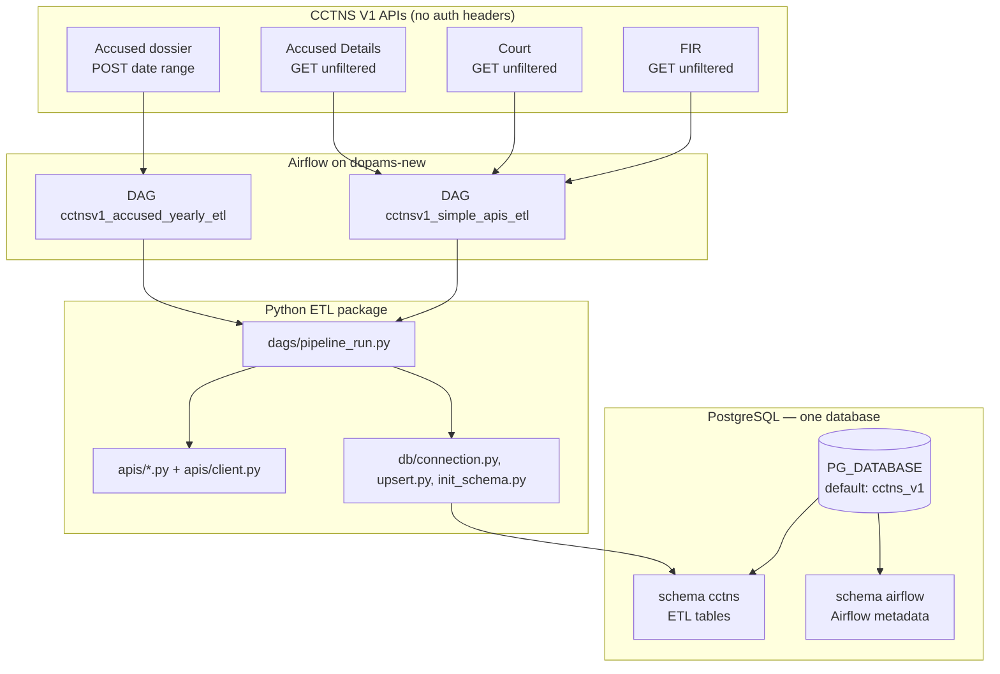
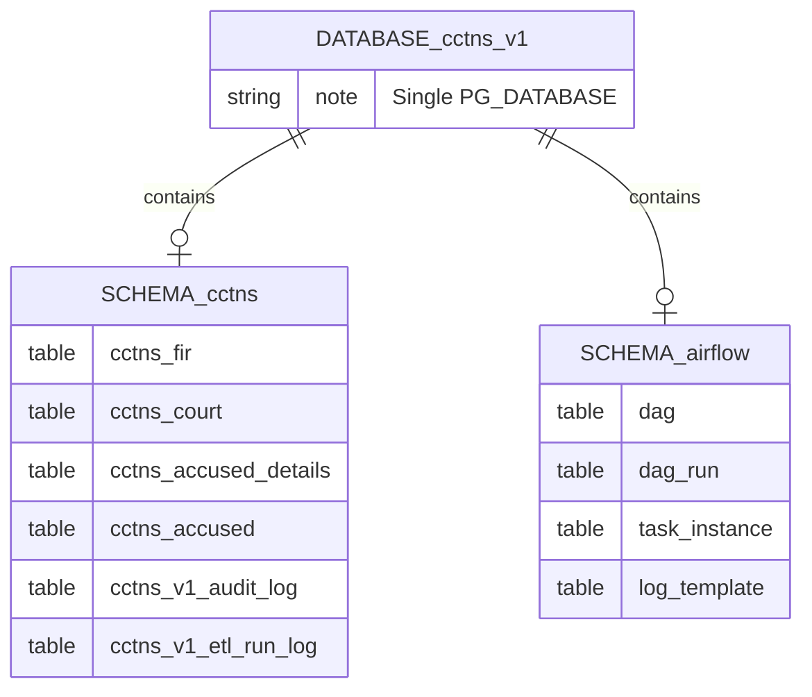
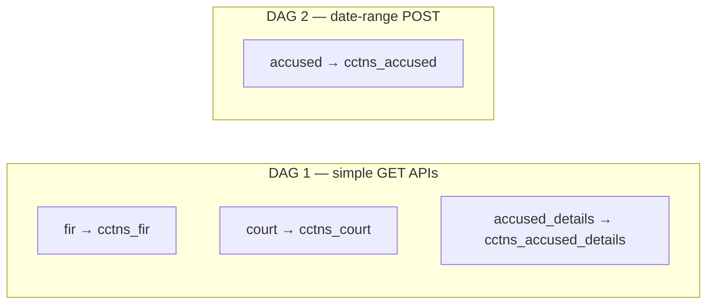
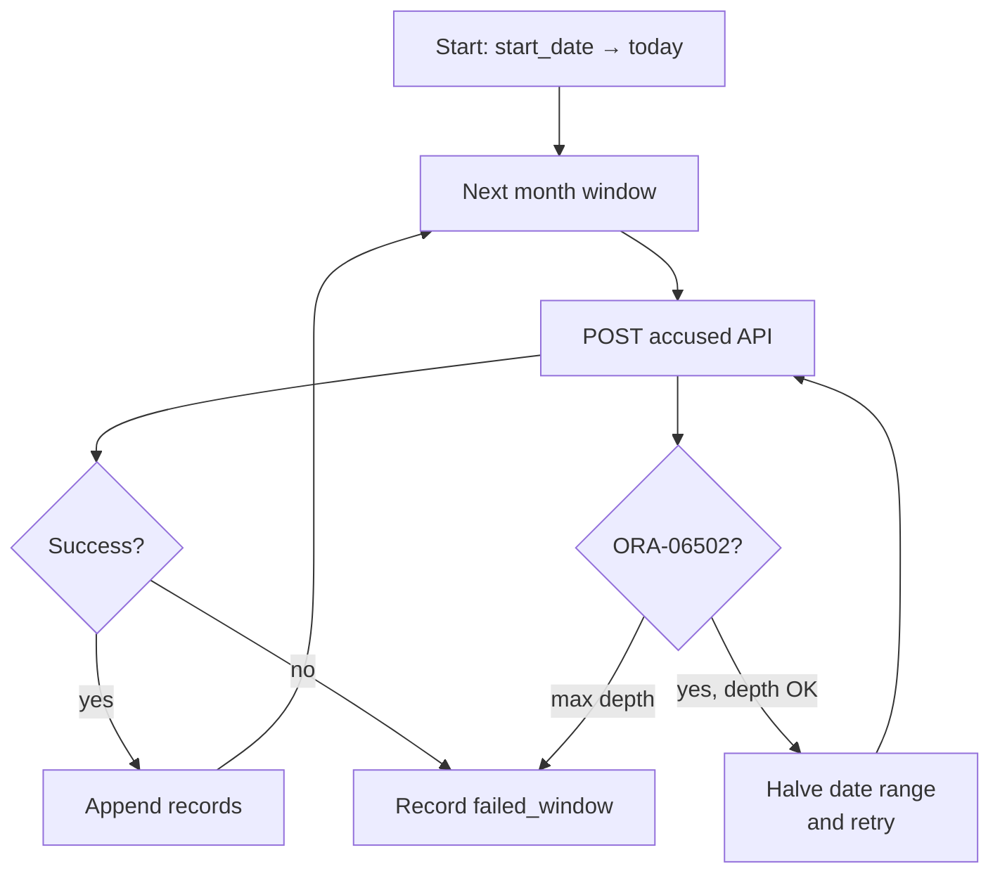
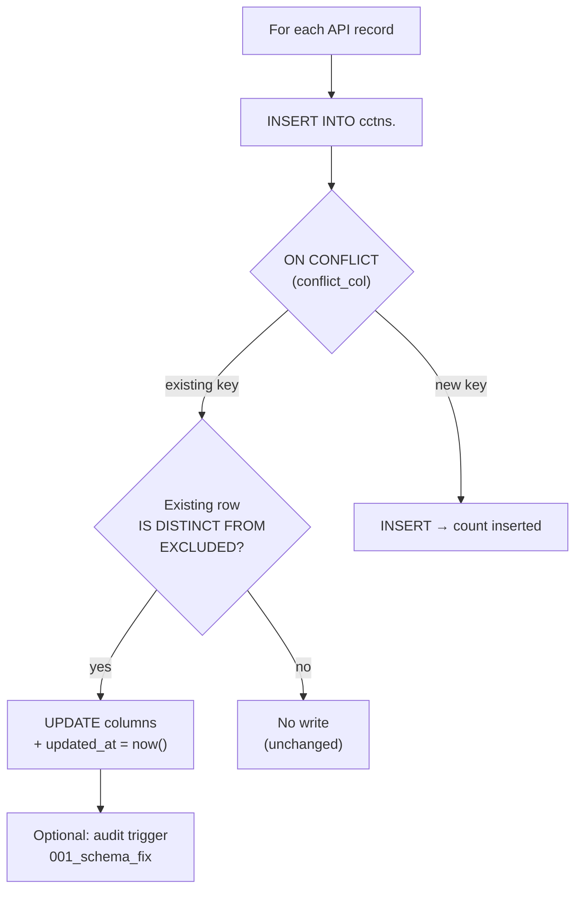
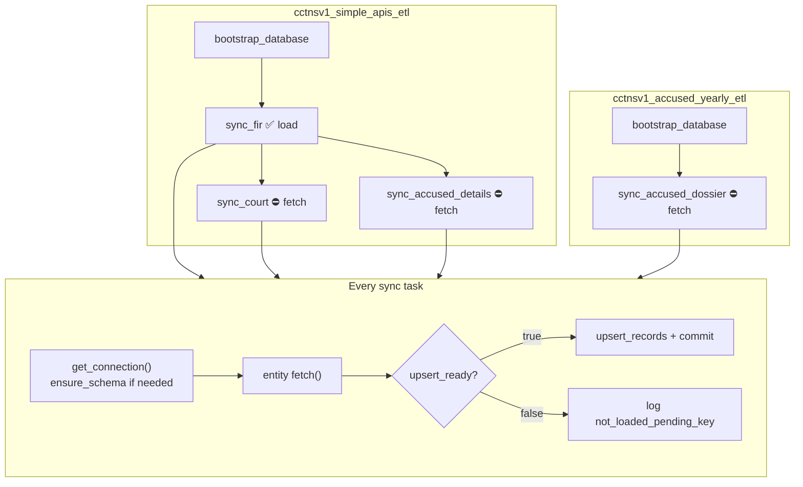

# CCTNS V1 Daily ETL — full overview

Nightly pipeline: pull data from **four CCTNS V1 HTTP APIs** on dopams infrastructure, load into **PostgreSQL** on **dopams-new**, orchestrated by **Apache Airflow 2.10** (two DAGs).

- **DAG behavior and task graphs:** [`dags/README.md`](dags/README.md)  
- **Deploy, PM2, Airflow UI:** [`deploy/README.md`](deploy/README.md)

---

## What problem this ETL solves

There is no dependable “changes since yesterday” filter on these APIs. The design is therefore:

1. **Re-fetch the full dataset every run** (or full date range for accused dossier).
2. **Validate** — remove duplicate keys within one API response; skip child rows with no parent FIR.
3. **Compare with Postgres** — insert if new, ignore if same, update if different.
4. **Log** every run and every insert/update in Postgres tables.

No intermediate JSON files on disk; records flow **API → memory → Postgres**.

## Pipeline stages (every entity task)



| Stage | Code | What it does |
|-------|------|----------------|
| **1. API** | `apis/*.py` | HTTP GET/POST → list of dicts |
| **2. Validate** | `db/validate.py` | `dedupe_batch`, `filter_orphan_fir` |
| **3. Load** | `db/upsert.py` | `INSERT … ON CONFLICT … IS DISTINCT FROM` |
| **4. Log** | `db/run_log.py` + DB triggers | Run summary + row actions + audit fields |

Orchestration: `dags/pipeline_run.py` → `_run_entities()`.

---

## End-to-end architecture



---

## Repository layout

```text
CCTNSV1_DAILY_ETL_RUN/
├── .env                    # secrets + URLs (not in git)
├── .env.example
├── config/settings.py      # loads .env; single config entry point
├── apis/
│   ├── client.py           # HTTP retry, month chunks, ORA-06502 halving
│   ├── fir.py, court.py, accused_details.py, accused.py
├── db/
│   ├── connection.py       # psycopg2 + search_path=cctns,public
│   ├── init_schema.py      # CREATE DB + apply SQL bootstrap
│   ├── upsert.py           # INSERT … ON CONFLICT … IS DISTINCT FROM
│   ├── airflow_metadata.py # wrapper → airflow db migrate
│   └── sql/
│       ├── init_schema.sql           # 4 entity tables in schema cctns
│       ├── init_etl_support.sql      # updated_at, audit/run log, triggers
│       ├── 002_migrate_etl_to_cctns_schema.sql
│       ├── 003_migrate_airflow_to_airflow_schema.sql
│       ├── 000_dedupe_exact_only.sql # ops: safe dedupe on live DB
│       └── 001_schema_fix.sql        # DRAFT: natural_key + upsert enablement
├── dags/
│   ├── simple_apis_etl.py
│   ├── accused_yearly_etl.py
│   ├── cctnsv1_dag_common.py
│   ├── pipeline_run.py
│   └── README.md           # DAG-focused doc
├── deploy/                 # PM2, airflow_with_env.sh
└── pipeline.md             # this file
```

---

## Configuration (`.env`)

| Variable | Meaning |
|----------|---------|
| `FIR_API_URL`, `COURT_API_URL`, `ACCUSED_DETAILS_API_URL`, `ACCUSED_API_URL` | Source endpoints |
| `PG_HOST`, `PG_PORT`, `PG_DATABASE`, `PG_USER`, `PG_PASSWORD` | Destination Postgres |
| `PG_ETL_SCHEMA` | ETL tables (default `cctns`) |
| `PG_AIRFLOW_SCHEMA` | Airflow metadata tables (default `airflow`) |
| `ACCUSED_FULL_PULL_START_DATE` | Start of accused dossier pull (`DD-MM-YYYY`, default `01-01-2002`) |

Airflow tasks always load `.env` from the project root via `config/settings.py`, regardless of Airflow’s working directory.

---

## Postgres: one database, two schemas



| Schema | Contents |
|--------|----------|
| **`cctns`** | All `cctns_*` business tables, sequences, FKs, ETL support objects |
| **`airflow`** | Scheduler/webserver state (not mixed into `public`) |

ETL connections use `options=-c search_path=cctns,public`. Airflow’s SQLAlchemy URL also sets `search_path` to the airflow schema (see `deploy/airflow_with_env.sh`).

**Bootstrap order** (`db/init_schema.py`):

1. Create `PG_DATABASE` if missing (needs `CREATEDB` or pre-created DB).
2. `002` / `003` — legacy moves from `public` if needed.
3. `init_schema.sql` — tables in `cctns`.
4. `init_etl_support.sql` — audit trigger, run log table, etc.

Each DAG run’s **`bootstrap_database`** task repeats this idempotently before sync tasks.

---

## The four data entities



| Entity | API module | HTTP | Approx. volume | Conflict key | Loads today? |
|--------|------------|------|----------------|--------------|--------------|
| **fir** | `apis/fir.py` | GET | ~7.3k rows | `fir_reg_num` (PK) | **Yes** |
| **court** | `apis/court.py` | GET | ~7.7k rows | `natural_key` (pending) | Fetch only |
| **accused_details** | `apis/accused_details.py` | GET | ~20k rows | `natural_key` (pending) | Fetch only |
| **accused** | `apis/accused.py` | POST chunked | large, 2002→today | `natural_key` (`006`) | **Yes** (slow; check `failed_windows`) |

Registry and flags: **`dags/pipeline_run.py`** (`SIMPLE_ENTITIES`, `ACCUSED_YEARLY_ENTITY`, `upsert_ready`).

---

## Extract layer

### Unfiltered GET (FIR, Court, Accused Details)

- Single request per endpoint (`apis/client.fetch_unfiltered`).
- Response normalized to a list of records (`data` key or raw list).
- Retries: 3 attempts, backoff (`REQUEST_TIMEOUT_SECS=60`).

### Accused dossier (date range)

- **`month_ranges`**: split `[ACCUSED_FULL_PULL_START_DATE, today]` by calendar month.
- For each chunk: POST with `from_date` / `to_date` (and alias keys).
- If response message contains **`ORA-06502`**, split the date range in half recursively (up to **`MAX_SPLIT_DEPTH`**).
- Returns `(records, failed_windows)` — any window that still fails is listed; pipeline does not pretend success for missing data.



---

## Load layer — upsert

Implemented in **`db/upsert.py`**.



Design choices:

- **No hash column** — Postgres compares real column values (`IS DISTINCT FROM`).
- **Generated / serial columns** excluded from insert list via `information_schema`.
- **`ON CONFLICT DO UPDATE … WHERE <table> IS DISTINCT FROM EXCLUDED`** — use the **bare table name** in `WHERE` (not `schema.table`) so Postgres resolves the target row correctly.

On **`load_failed`**, the entity transaction is rolled back; Airflow task fails and retries.

---

## Orchestration flow (both DAGs combined)



---

## Current operational status

| Step | Status |
|------|--------|
| Airflow + PM2 on dopams-new | Running (UI port **9001**) |
| Schema split `cctns` / `airflow` | Configured |
| **FIR** nightly upsert | **Enabled** — expect ~7.3k rows in `cctns.cctns_fir` after successful `sync_fir` |
| Court, accused details, accused | **Extract only** until `001_schema_fix.sql` is reviewed and applied, and `upsert_ready` flipped in `pipeline_run.py` |
| `cctns_v1_etl_run_log` / rich audit | Requires **`001_schema_fix.sql`** (draft) |

---

## Enabling load for the other three tables (checklist)

1. On live Postgres, run **`db/sql/000_dedupe_exact_only.sql`** (exact duplicate rows only).
2. Review ambiguous groups (query at top of **`db/sql/001_schema_fix.sql`**).
3. Finalize **`natural_key`** expressions in that file; uncomment and run the migration.
4. In **`dags/pipeline_run.py`**, set `"upsert_ready": True` for `court`, `accused_details`, and/or `accused`.
5. Trigger DAGs or wait for 00:30 UTC; verify counts in `cctns_*` and task logs (`inserted=` / `updated=`).

---

## Observability

| Signal | Location |
|--------|----------|
| Fetch / load summary | Airflow task logs (`fetched=`, `inserted=`, `updated=`, `unchanged=`) |
| Fetch-only warning | Log line: `NOT loaded -- natural_key/unique constraint not applied yet` |
| Accused gaps | Log `failed_windows` count and details in accused task log |
| Postgres row counts | `SELECT COUNT(*) FROM cctns.cctns_fir;` (set `search_path` or qualify schema) |
| Durable run history | `cctns.cctns_v1_etl_run_log` (after schema fix migration) |
| Field-level changes | `cctns.cctns_v1_audit_log` (after migration + updates) |

---

## Design rationale (short)

| Decision | Why |
|----------|-----|
| Full pull every night | API has no trusted incremental cursor |
| Upsert with `IS DISTINCT FROM` | Avoid spurious writes and manual diff code |
| Two DAGs | Accused POST is slow and failure-prone; do not block FIR |
| Fetch-only until keys reviewed | Wrong `natural_key` would merge distinct people (see `001_schema_fix.sql` header) |
| Same DB for ETL + Airflow | Simpler ops on dopams-new; separated by **schema** |
| `.env` at project root | Airflow task subprocesses always see API URLs and Postgres creds |

---

## Related docs

- **[`dags/README.md`](dags/README.md)** — task graphs, success vs loaded, CLI trigger, local test commands  
- **[`deploy/README.md`](deploy/README.md)** — one-time setup, PM2 reload, troubleshooting Airflow UI
