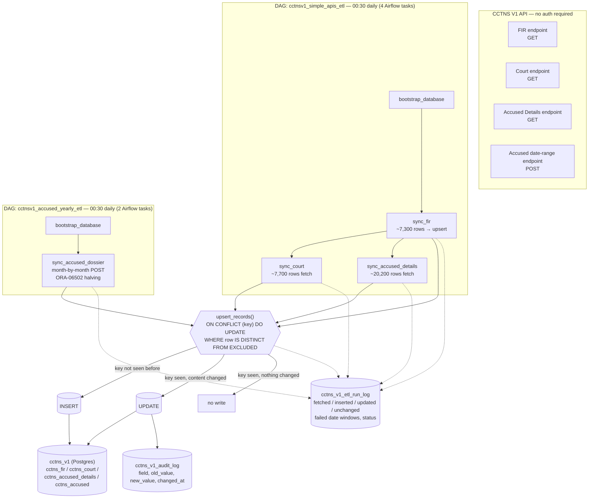

# CCTNS V1 Daily ETL — how it works

## Flow

The key used to detect "have I seen this record before": `fir_reg_num` for `cctns_fir`, `natural_key` for the other 3 tables (see `db/sql/001_schema_fix.sql`).

Both DAGs pull the **full dataset every run** — there's no reliable "give me what changed since yesterday" filter on this API, so instead the pipeline re-fetches everything and lets Postgres decide what actually changed via the `ON CONFLICT ... WHERE IS DISTINCT FROM` upsert in `db/upsert.py`. No hash column, no manual diff code — Postgres compares the real row values directly.

Nothing is written to local disk. Data goes straight from the API into Postgres in memory; logging goes to stdout, captured by Airflow as each task's log.

## Why two DAGs, not one

`fetch_accused()` is the one endpoint that needs date-chunking — its Oracle backend throws buffer errors on wide ranges, confirmed from real captured runs. The other 3 endpoints are a single unfiltered GET each, no chunking needed. Kept as separate DAGs since the accused pull is slower and more failure-prone — easier to monitor and retry on its own without blocking the other 3.

## Current status

| Entity | Loads to Postgres? |
|---|---|
| `fir` | ✅ yes — real primary key, no duplicates |
| `court`, `accused_details`, `accused` | ⛔ fetched every run, but not loaded yet — the business key (`natural_key`) hasn't been finalized (see `db/sql/001_schema_fix.sql`) |

Setup, deployment, and verification steps live in `deploy/README.md`, not here.
