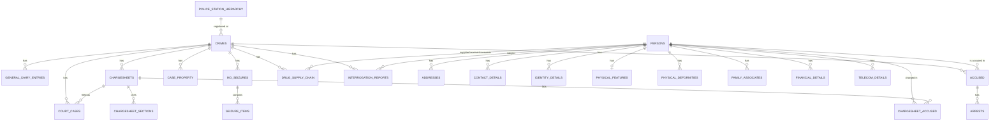

# CCTNS Unified Schema — Design Rationale

This document explains **why** the merged CCTNS V1/V2 schema was built the way
it is, shows the **entity relationship diagram**, describes **how to use it**,
and lists **future enhancements**. Pairs with [`schema.sql`](schema.sql) and
[`README.md`](README.md).

---

## 1. Why a normalized relational (SQL) schema, and not the alternatives

Four formats were on the table. Here's why relational SQL won for this data.

| Option | Why it was rejected here |
|---|---|
| **JSON Schema** (validate-only) | Only validates shape — gives no way to *query* "all accused with a bank account linked to a supplier in another crime" or enforce that an `ACCUSED_ID` really points to a real `CRIME_ID` and `PERSON_ID`. Good for API contracts, not for a system of record. |
| **MongoDB / Mongoose (document store)** | This is what V2 *already is*. Copying it forward would just re-inherit V2's problem: the same person's identity, family, and financial data gets duplicated inside every crime document they're linked to, so a name correction has to be replayed across N documents. It also can't cheaply express "all crimes this person was accused in" without a secondary index and app-level joins anyway. |
| **Python Pydantic models** | Great for validating a script's in-memory objects during ETL, but Pydantic models aren't a place data *lives* — you'd still need a database behind them. This would just be one more layer on top of whichever schema is chosen. |
| **Normalized SQL (chosen)** | A `PERSON_ID` and `CRIME_ID` are genuinely relational facts: one person can be accused in many crimes (repeat offenders — the entire point of cross-referencing V1 and V2), one crime has many accused, many seizures, many chargesheet sections. Foreign keys make those relationships enforced by the database, not by application discipline. |

Concretely, three things about *this specific data* drove the decision:

1. **Repeat-offender / cross-case linking is the actual goal.** The report's "Drug Supply-Chain Graph" and person-360 profile only pay off if you can ask "what other crimes/seizures/chargesheets touch this `PERSON_ID`?" in one query. That's a join, not a document lookup.
2. **V1's flat columns were already begging to be normalized.** 60 `INT_*` interrogation columns, 9 identity-proof columns, 14 deformity columns — these are repeating groups pretending to be scalar columns. Turning them into child tables (`family_associates`, `identity_details`, `physical_deformities`) isn't a stylistic choice, it's fixing a modeling mistake V1 made, and it's the only way V1 and V2 data can land in the *same* row shape.
3. **Referential integrity matters for police/court data.** A chargesheet accused row (`chargesheet_accused.accused_person_id`) pointing at a person that doesn't exist, or a seizure pointing at a nonexistent crime, is a data-quality bug you want the database to refuse, not one you discover during an audit.

**Trade-off accepted:** SQL is less forgiving of schema drift than JSON/Mongo — every new V2 field needs a migration (`ALTER TABLE`) instead of just appearing in a document. Section 4 addresses this.

---

## 2. Entity relationship diagram



*(GitHub, GitLab, VS Code's Markdown preview, and most modern editors render
Mermaid diagrams inline. If yours doesn't, paste this block into
[mermaid.live](https://mermaid.live).)*

`MEDIA_FILES` is intentionally left off the diagram — it's a polymorphic
table (`entity_type` + `entity_id`) attaching to persons, seizures,
chargesheets, or crimes, which ER diagrams can't express as a clean line.

---

## 3. How to use this schema

### 3.1 Apply it

```bash
createdb cctns
psql -d cctns -f schema.sql
```

### 3.2 Load data (ETL from the raw V1/V2 JSON)

The raw API responses already sitting in `cctnsv1/response/` and
`cctnsv2/response/` are the source. A loader script should, per record:

1. Insert into `crimes`/`persons` first, always setting `source_system` and
   `source_record_id` — every other table hangs off these two.
2. Use `INSERT ... ON CONFLICT (source_system, source_record_id) DO UPDATE`
   so re-running the loader on refreshed API pulls is idempotent.
3. For a person appearing in both V1 and V2 under different IDs, resolve to
   **one** `persons` row (match on name + DOB + father's name + mobile, the
   same fields the comparison report already calls "Direct Column Mapping")
   before inserting — this is where the real "merge" work happens, and it's
   an application-layer step, not something the schema does for you.

### 3.3 Query examples

Cross-referencing was the whole point — that's now a normal join:

```sql
-- All crimes and chargesheet status for a given person, across cases
SELECT c.fir_num, c.case_status, ch.charge_sheet_no, ch.court_name
FROM persons p
JOIN accused a ON a.person_id = p.person_id
JOIN crimes c ON c.crime_id = a.crime_id
LEFT JOIN chargesheet_accused ca ON ca.accused_person_id = p.person_id
LEFT JOIN chargesheets ch ON ch.charge_sheet_id = ca.charge_sheet_id
WHERE p.person_id = '6542b1110559fea26e841a1b';

-- Supply-chain: everyone this person has supplied drugs to
SELECT r.full_name AS receiver, c.fir_num
FROM drug_supply_chain dsc
JOIN persons r ON r.person_id = dsc.receiver_person_id
JOIN crimes c ON c.crime_id = dsc.crime_id
WHERE dsc.supplier_person_id = '6542b1110559fea26e841a1b';
```

### 3.4 Reporting

Because the model is relational, existing tools (Metabase, Superset, plain
`psql`, Excel via ODBC) can point at it directly — no bespoke aggregation
code needed the way the old `generate_*_excel.py` scripts had to write.

---

## 4. Future enhancements

All of these are additive — none require reshaping the tables already built.

- **Schema migrations tool** (Flyway/Alembic/sqitch) — track `ALTER TABLE`
  changes as V2's API evolves, instead of hand-editing `schema.sql`.
- **Full-text search** on `crimes.brief_facts` and `interrogation_reports.content`
  via Postgres `tsvector`, for keyword search across FIR narratives.
- **GIS indexing** — `mo_seizures.pos_latitude/pos_longitude` are plain
  `NUMERIC` today; adding PostGIS (`geography` column + GiST index) would
  enable "seizures within N km of this point" queries.
- **Materialized views** for the person-360 profile and dashboard summaries
  (`CREATE MATERIALIZED VIEW`, refreshed on a schedule) so heavy joins
  don't get re-run on every dashboard load.
- **Audit/history table** (or Postgres `pgaudit`) to track who changed what
  and when — important for a law-enforcement system of record.
- **Person deduplication pipeline** — a proper record-linkage step (fuzzy
  match on name/DOB/mobile/address) instead of a one-off match at load time,
  since more V1/V2 sources will keep arriving with new spellings of the same
  name.
- **Row-level security** (native Postgres RLS) to restrict which PS/district
  rows a given user role can see — CCTNS data is sensitive by nature.
- **A thin API layer** (FastAPI/Express) over these tables for the frontend,
  instead of scripts reading JSON directly.
- **Graph queries for the supply chain** — `drug_supply_chain` is usable in
  SQL today with recursive CTEs (`WITH RECURSIVE`), but if the network grows
  large a dedicated graph extension (Apache AGE on Postgres, or Neo4j fed
  from this table) would make multi-hop tracing faster.

**Not recommended:** migrating this to a document store later. The whole
reason for choosing SQL was the relational structure of person↔crime↔
seizure↔court; moving back to documents would re-introduce the duplication
problem this schema was built to avoid.
